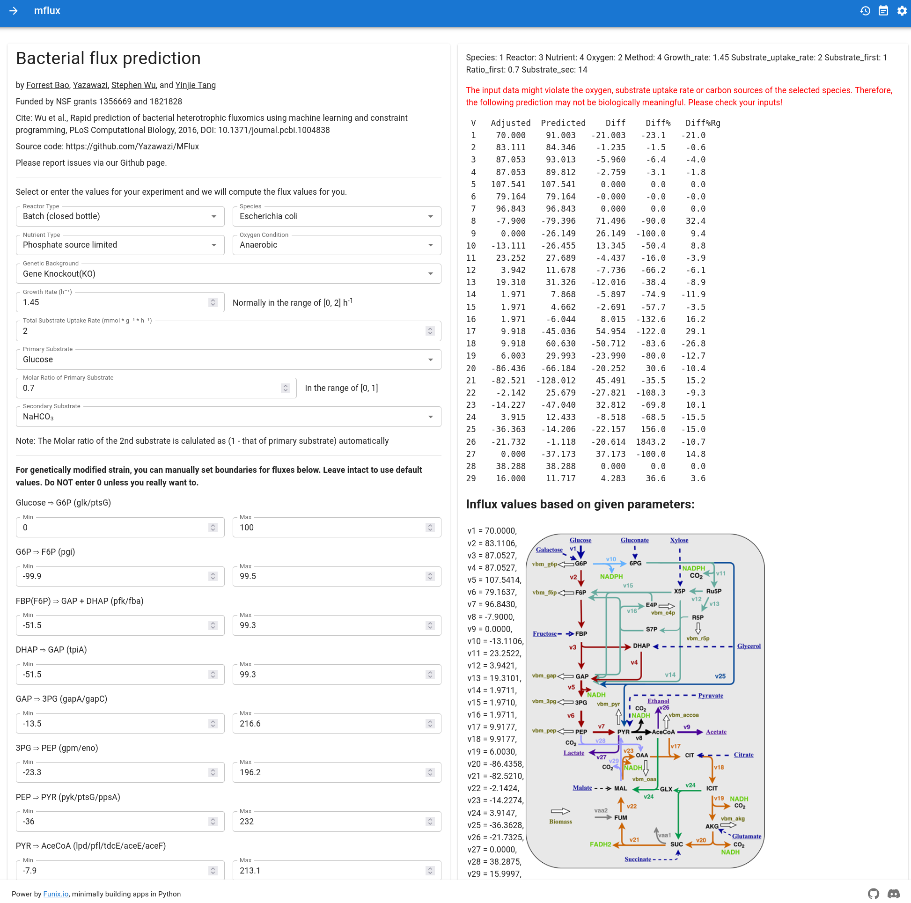

# MFlux

> Try this online: http://mflux.example.funix.io/

Remake version from [mflux](https://github.com/forrestbao/mflux). Done with [TexTea](https://github.com/TexteaInc/)'s [Funix](https://github.com/TexteaInc/funix), the minimalist way to build web apps in Python.

## Setup

You need Python 3 environment to run this project.

1. `sudo pip install -r requirements.txt` to install dependencies.
2. `python get_model.py` to generate model files.

## Usage

1. `funix main.py` to start the server. Or run `sh app.sh` to generate model files and start the server.
2. Done, you can use MFlux now!

## License

See `LICENSE` file.
